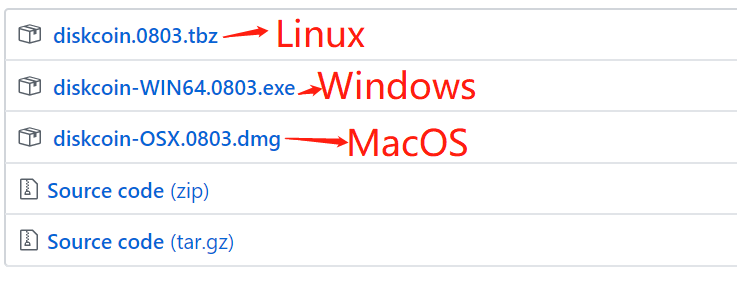

## How to Plot?

### Plotter ID
Click on [Diskcoin PID Generator](https://diskcoin.org/PidGenerator/index.html#btnGroup) to check whether your PID is applicable. If yes, you are no need to replot files to mine DISC. If your PID is not applicable, you need to use the tool to generate new PID and then plot if you want to mine DISC. Kindly note that with the PID generated by Diskcoin PID Generator, you could also mine other POC coins together. 


### Plotting Software

#### ENGRAVER

Engraver is a plotter that natively generates optimized plot files. It generates PoC2 files and is intended to work on any UNIX system with a sufficiently sane filesystem (able to pre-allocate space),but for now only Linux and MacOS have been tested. 64bit only!

Main Developer : PoC-Consortium

Download link : <https://github.com/PoC-Consortium/engraver>

Platform : Linux, MacOS

Installation guide : Compile from Source


#### TurboPlotter 9000

TurboPlotter 9000 is a CPU/GPU PoC 1 + PoC 2 plotter and plot integrity checker.

Main Developer : Blackpawn

Download link : <https://blackpawn.com/tp/>

Platform : Windows, Linux, MacOS


#### XPlotterGui

XplotterGui is a GUI version of Xplotter with SSD Cache, File Merging and POC2 Conversion features.

Main Developer : JohnnyFFM

Download link : <https://github.com/JohnnyFFM/XPlotterGui/releases/latest>

Platform : Windows


#### XPlotter modded
XPlotter is the default plotter that comes with QBundle and provides CPU PoC 1 plotting with AVX support. This modded version supports PoC2 plotting.

Main Developer : JohnnyFFM

Download link : <https://github.com/JohnnyFFM/XPlotter/releases/latest>

Platform : Windows


## How to Mine Diskcoin?

### Preparation for mining

1.A hard disk mining device that has been assembled and plotted.

2.A Linux/Windows/MacOS system computer that can install the Diskcoind wallet.

3.A Windows system computer that can run the dcminer.


### Deploy Diskcoind wallet

Please click the link to download the wallet according to your system:
<https://github.com/diskcoin-apps-team/wiki/releases>




#### Linux system:

Install the Diskcoind

Please copy it to the prepared Linux server and unzip it.

Modify the configuration file

The configuration file "diskcoin.conf" does not need to modify by default, unless the ports are occupied.

Start the Diskcoind service

Enter the Diskcoind directory

cd diskcoin

Start Diskcoind service command

```
./diskcoin-qt -rpcbind=127.0.0.1 -rpcallowip="127.0.0.1/32"
```

Wait for the Diskcoind to sync full node data

```
./diskcoin-cli getinfo View current block height

./diskcoin-cli getblockcount View the latest height
```

If the two values are the same, then the full node data has been synced, indicating that you can start mining.


#### Windows/MacOS system:

Install the Diskcoind

Please copy it to the prepared Windows or MacOS server and unzip it. If you have previously installed the Diskcoin wallet, please delete previous data before installation.

Start Diskcoind service command
First enter the installation directory of Diskcoin, there is a diskcoin-qt.exe file, as the figure shows:


##### Windows:

Press "Windows" and "R" at the same time, there is a search box. Enter "cmd" to go to the Windows console and execute the following startup command. 
```
Your wallet installation path/diskcoin-qt.exe  -rpcallowip=127.0.0.1/32 -rpcbind=127.0.0.1 
```


##### MacOS:

MacOS is the same operation, but the command is different.
MacOS startup command: 
```
Applications/Diskcoin-Qt.app/Contents/MacOS/Diskcoin-Qt -rpcallowip=127.0.0.1/32 -rpcbind=127.0.0.1```
```


If the wallet can be launched, the operation is successful and the miner file can be configured. As the figure shows:


###How to get the wallet address?

When you open the wallet, it need some time to sync. As the figure shows:


Click on "receive", and then click on the "Request payment" to get the wallet address.


Please keep your wallet confidential when you successfully get the wallet address. As the figure shows: 


### Start mining

The dcminer needs to run in the windows environment.

Modify the mining device configuration file: miner.conf


```
"Server": "127.0.0.1",
"Port": 63336,
"UpdaterAddr": "127.0.0.1",
"UpdaterPort": 63336,
"InfoAddr": "127.0.0.1",
"InfoPort": 63336,
MinerName = m1 #can be empty
```

Others can use the default value.

Please run dcminer with this order, it is recommended to use dcminerAVX512 first. If it can not be started, then use dcminerAVX2. and then dcminerAVX. If the three mentioned above cannot be started,  you could use the dcminer.exe.


#### Download installation package: <https://github.com/diskcoin-apps-team/wiki/releases/latest>
